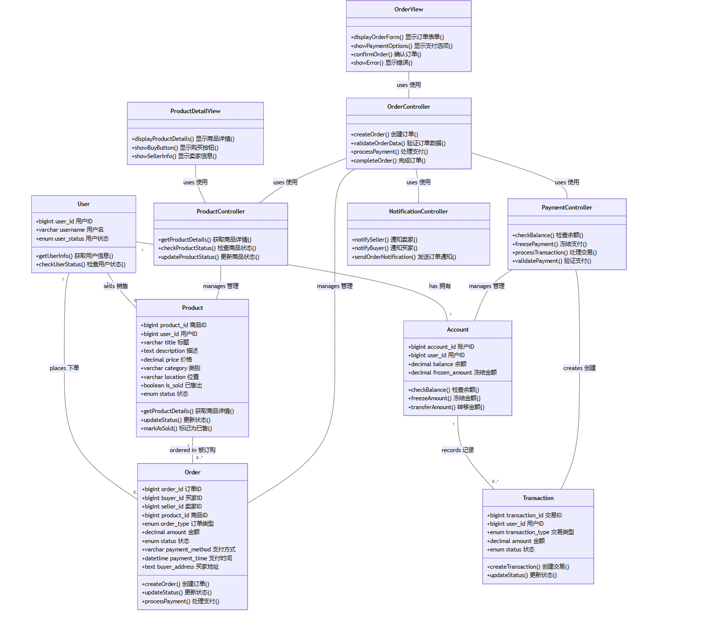

# 截图与视觉资料

当前仓库已经保留了两张与项目展示相关的图片，但还缺少正式的功能界面截图。为了求职展示，建议后续补齐真实页面截图，并放入 `docs/screenshots/`。

## 已有图片

### 校园氛围图


用途：适合作为 README 或作品集页面的背景视觉素材，不建议作为功能截图，因为它不能证明系统功能。

### 订单/支付类图



用途：适合在面试中说明商品、订单、账户、交易、支付和通知之间的设计关系。

## 建议补齐的功能截图

| 截图 | 建议页面 | 展示重点 |
| --- | --- | --- |
| 用户端首页 | `/` | 校园动态流、导航、通知入口 |
| 校园集市 | `/market` | 商品列表、筛选、发布入口 |
| 商品详情 | `/market/product/:id` | 商品详情、卖家信息、订单入口 |
| 悬赏任务 | `/missions` | 任务列表、发布任务、任务状态 |
| 任务详情 | `/missions/:id` | 接单、进度、确认流程 |
| 个人中心 | `/profile` | 用户信息、发布记录、订单/任务 |
| 管理后台首页 | `/dashboard` | 数据看板、管理菜单 |
| 学校管理后台 | `/school-admin/dashboard` | 学校管理员审核与管理入口 |

## 截图命名建议

```text
docs/screenshots/
├── user-home.png
├── market-list.png
├── product-detail.png
├── mission-list.png
├── mission-detail.png
├── profile.png
├── admin-dashboard.png
└── school-admin-dashboard.png
```

## 面试使用建议

展示顺序建议为：用户端首页 -> 集市/悬赏核心流程 -> 管理后台审核 -> 数据库/类图设计。这样能同时体现产品完整度、业务闭环和工程设计能力。
