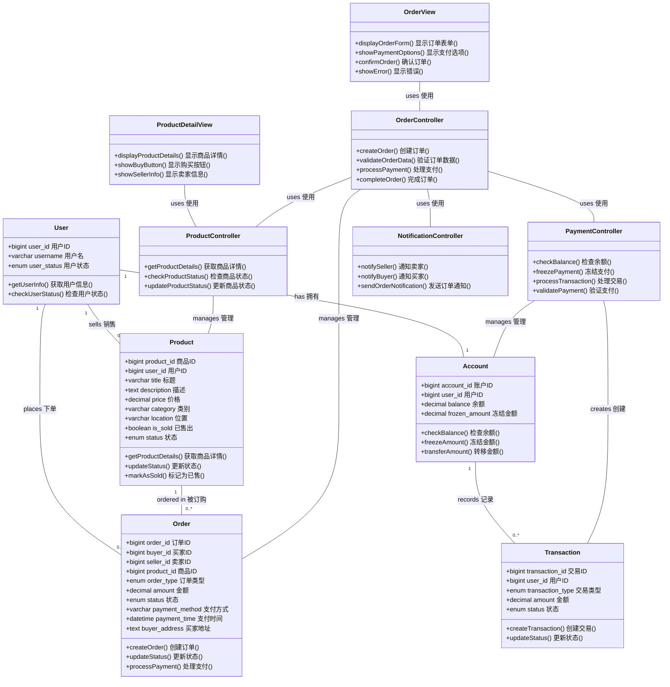
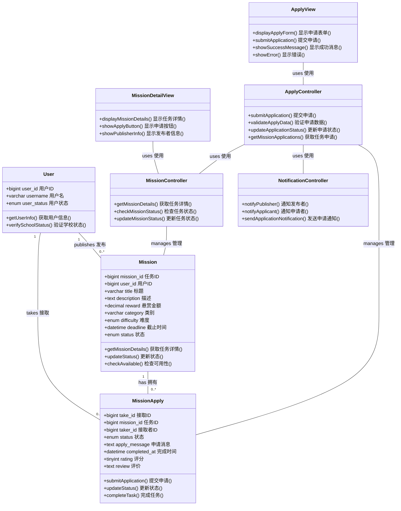
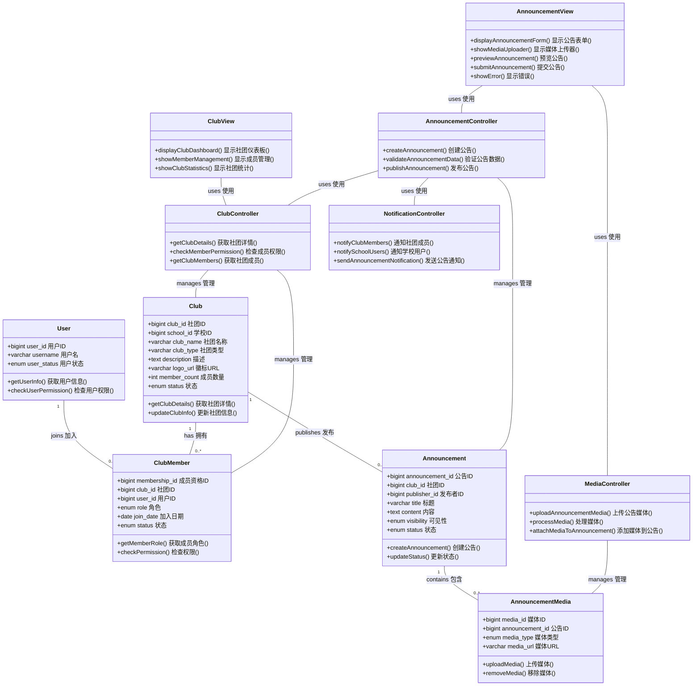
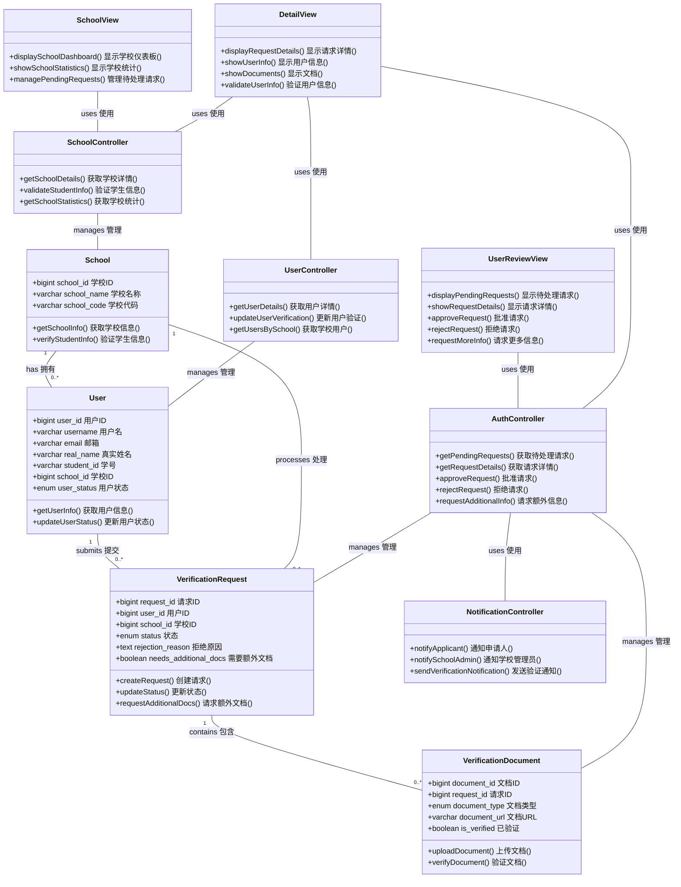
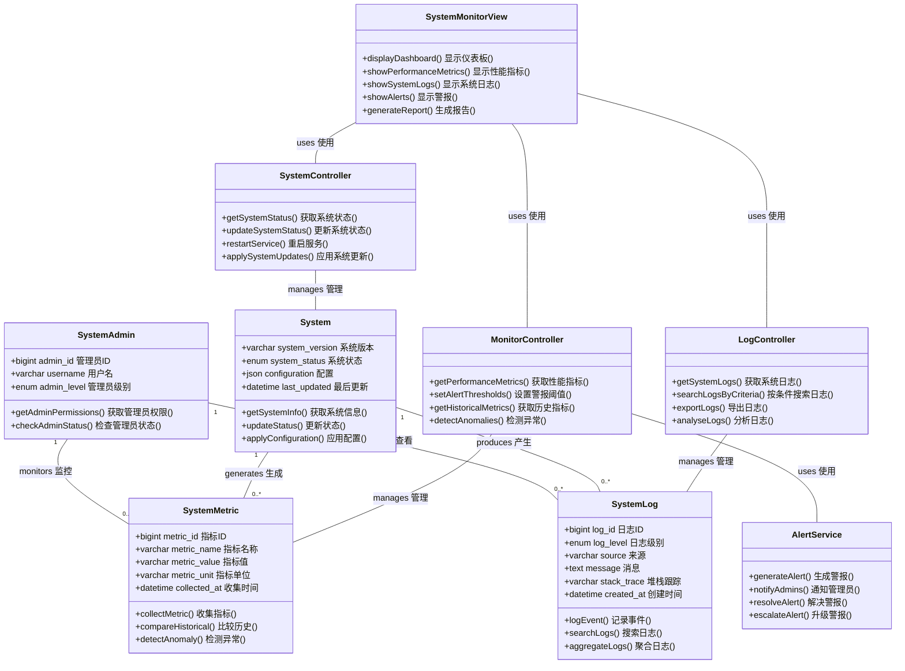
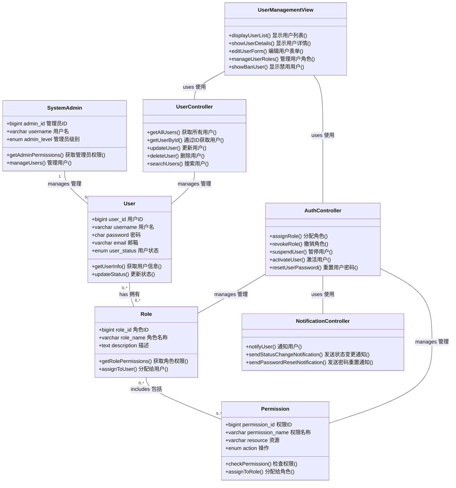
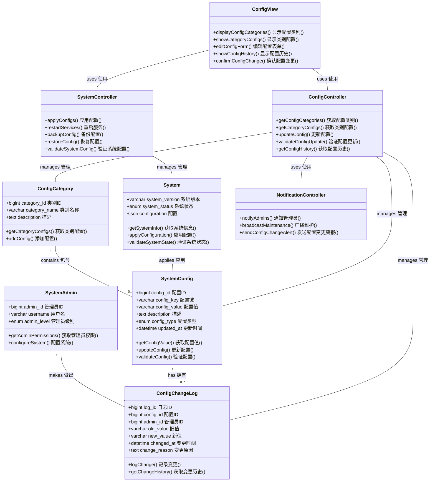

1. 发布动态分析类图

```mermaid
classDiagram
    class User {
        +bigint user_id 用户ID
        +varchar username 用户名
        +char password 密码
        +varchar email 邮箱
        +varchar phone 电话
        +varchar student_id 学号
        +enum user_status 用户状态
        +verifySchoolStatus() 验证学校状态()
        +getUserInfo() 获取用户信息()
    }
    
    class Post {
        +bigint post_id 动态ID
        +bigint user_id 用户ID
        +text content 内容
        +enum post_type 动态类型
        +enum visibility 可见性
        +varchar location 位置
        +int like_count 点赞数
        +int comment_count 评论数
        +int share_count 分享数
        +enum status 状态
        +createPost() 创建动态()
        +updatePost() 更新动态()
        +deletePost() 删除动态()
    }
    
    class PostMedia {
        +bigint media_id 媒体ID
        +bigint post_id 动态ID
        +enum media_type 媒体类型
        +varchar media_url 媒体URL
        +varchar thumbnail_url 缩略图URL
        +tinyint display_order 显示顺序
        +uploadMedia() 上传媒体()
        +removeMedia() 移除媒体()
    }
    
    class PostView {
        +displayPostForm() 显示发布表单()
        +showMediaUploadOptions() 显示媒体上传选项()
        +previewPost() 预览动态()
        +submitPost() 提交动态()
        +showError() 显示错误()
    }
    
    class AuthController {
        +verifySchoolAuth() 验证学校认证()
        +getAuthStatus() 获取认证状态()
        +checkCredentials() 检查凭证()
    }
    
    class PostController {
        +createPost() 创建动态()
        +attachMedia() 附加媒体()
        +validatePostData() 验证动态数据()
        +submitPost() 提交动态()
    }
    
    class MediaController {
        +uploadMedia() 上传媒体()
        +processMedia() 处理媒体()
        +generateThumbnail() 生成缩略图()
        +saveMediaToPost() 保存媒体到动态()
    }
    
    User "1" -- "0..*" Post : publishes 发布
    Post "1" -- "0..*" PostMedia : contains 包含
    PostView -- PostController : uses 使用
    PostView -- MediaController : uses 使用
    PostController -- AuthController : uses 使用
    PostController -- User : validates 验证
    PostController -- Post : manages 管理
    MediaController -- PostMedia : manages 管理


2. 发布商品分析类图

```mermaid
classDiagram
    class User {
        +bigint user_id 用户ID
        +varchar username 用户名
        +varchar email 邮箱
        +enum user_status 用户状态
        +verifySchoolStatus() 验证学校状态()
        +getUserInfo() 获取用户信息()
    }
    
    class Product {
        +bigint product_id 商品ID
        +bigint user_id 用户ID
        +varchar title 标题
        +text description 描述
        +decimal price 价格
        +decimal original_price 原价
        +varchar category 类别
        +enum condition_type 商品状况
        +varchar location 位置
        +boolean is_negotiable 可议价
        +boolean is_sold 已售出
        +enum status 状态
        +int view_count 浏览量
        +createProduct() 创建商品()
        +updateProductStatus() 更新商品状态()
        +setNegotiable() 设置可议价()
    }
    
    class ProductImage {
        +bigint image_id 图片ID
        +bigint product_id 商品ID
        +varchar image_url 图片URL
        +tinyint display_order 显示顺序
        +uploadImage() 上传图片()
        +updateOrder() 更新顺序()
        +removeImage() 移除图片()
    }
    
    class ProductView {
        +displayProductForm() 显示商品表单()
        +showImageUploader() 显示图片上传器()
        +previewProduct() 预览商品()
        +submitProduct() 提交商品()
        +showError() 显示错误()
    }
    
    class AuthController {
        +verifySchoolAuth() 验证学校认证()
        +getAuthStatus() 获取认证状态()
        +checkUserStatus() 检查用户状态()
    }
    
    class ProductController {
        +createProduct() 创建商品()
        +validateProductData() 验证商品数据()
        +updateProduct() 更新商品()
        +checkProductStatus() 检查商品状态()
    }
    
    class ImageController {
        +uploadProductImage() 上传商品图片()
        +processImage() 处理图片()
        +validateImage() 验证图片()
        +attachImageToProduct() 添加图片到商品()
    }
    
    User "1" -- "0..*" Product : publishes 发布
    Product "1" -- "0..*" ProductImage : has 拥有
    ProductView -- ProductController : uses 使用
    ProductView -- ImageController : uses 使用
    ProductController -- AuthController : uses 使用
    ProductController -- Product : manages 管理
    ImageController -- ProductImage : manages 管理


3. 发布悬赏分析类图

```mermaid
classDiagram
    class User {
        +bigint user_id 用户ID
        +varchar username 用户名
        +enum user_status 用户状态
        +verifySchoolStatus() 验证学校状态()
        +checkUserCredit() 检查用户信用()
    }
    
    class Mission {
        +bigint mission_id 任务ID
        +bigint user_id 用户ID
        +varchar title 标题
        +text description 描述
        +decimal reward 悬赏金额
        +varchar category 类别
        +enum difficulty 难度
        +decimal estimated_hours 预计时间
        +varchar location 地点
        +datetime deadline 截止时间
        +enum status 状态
        +int view_count 浏览量
        +createMission() 创建任务()
        +updateStatus() 更新状态()
        +checkDeadline() 检查截止时间()
    }
    
    class Account {
        +bigint account_id 账户ID
        +bigint user_id 用户ID
        +decimal balance 余额
        +decimal frozen_amount 冻结金额
        +checkBalance() 检查余额()
        +freezeAmount() 冻结金额()
        +updateBalance() 更新余额()
    }
    
    class Transaction {
        +bigint transaction_id 交易ID
        +bigint user_id 用户ID
        +enum transaction_type 交易类型
        +decimal amount 金额
        +enum status 状态
        +varchar reference_id 参考ID
        +text description 描述
        +createTransaction() 创建交易()
        +updateStatus() 更新状态()
        +completeTransaction() 完成交易()
    }
    
    class MissionView {
        +displayMissionForm() 显示任务表单()
        +showRewardInput() 显示悬赏输入()
        +previewMission() 预览任务()
        +submitMission() 提交任务()
        +showError() 显示错误()
    }
    
    class AuthController {
        +verifySchoolAuth() 验证学校认证()
        +getAuthStatus() 获取认证状态()
        +checkUserPermission() 检查用户权限()
    }
    
    class MissionController {
        +createMission() 创建任务()
        +validateMissionData() 验证任务数据()
        +updateMission() 更新任务()
        +checkDeadline() 检查截止时间()
    }
    
    class PaymentController {
        +checkBalance() 检查余额()
        +freezeReward() 冻结悬赏()
        +createTransaction() 创建交易()
        +validatePayment() 验证支付()
    }
    
    User "1" -- "0..*" Mission : publishes 发布
    User "1" -- "1" Account : has 拥有
    Account "1" -- "0..*" Transaction : records 记录
    MissionView -- MissionController : uses 使用
    MissionView -- PaymentController : uses 使用
    MissionController -- AuthController : uses 使用
    MissionController -- Mission : manages 管理
    PaymentController -- Account : manages 管理
    PaymentController -- Transaction : creates 创建
```

4. 购买商品分析类图



5. 接取悬赏分析类图



6. 发布社团公告分析类图



7. 审核加入校园人员分析类图



8. 系统监控分析类图



9. 用户管理分析类图



10. 系统配置分析类图


