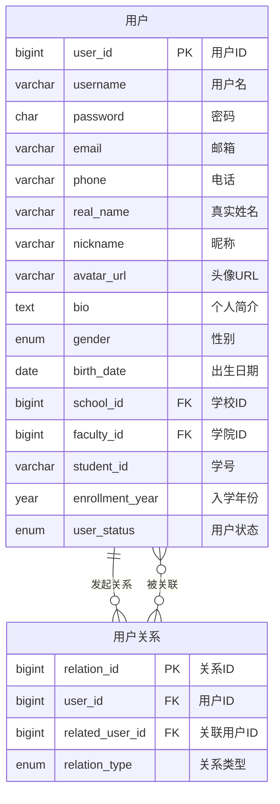
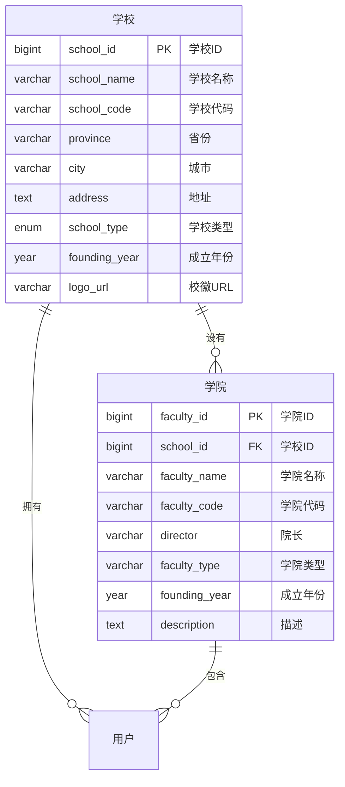
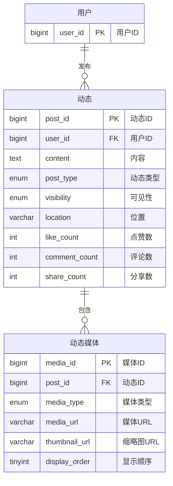
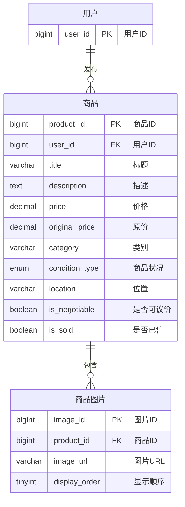
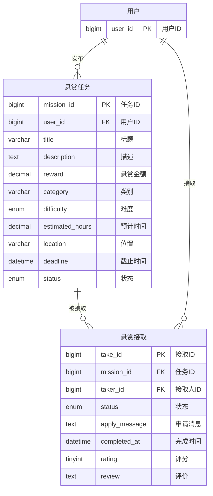
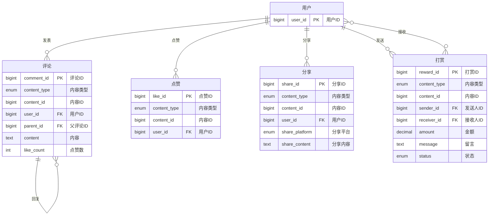
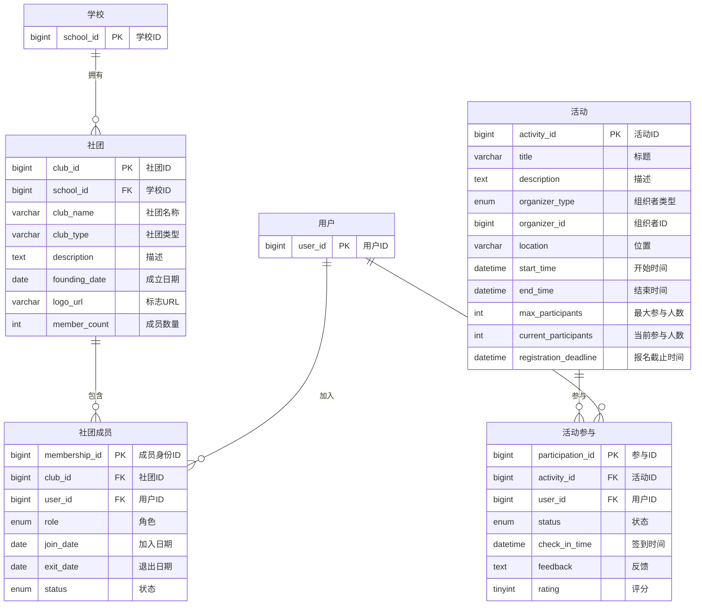
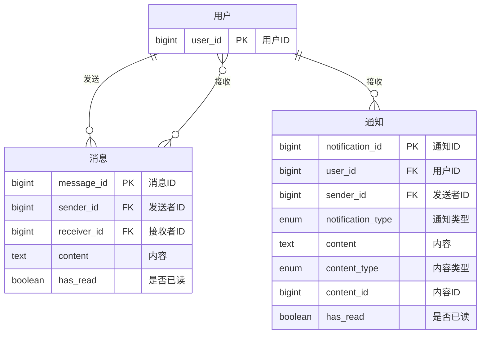
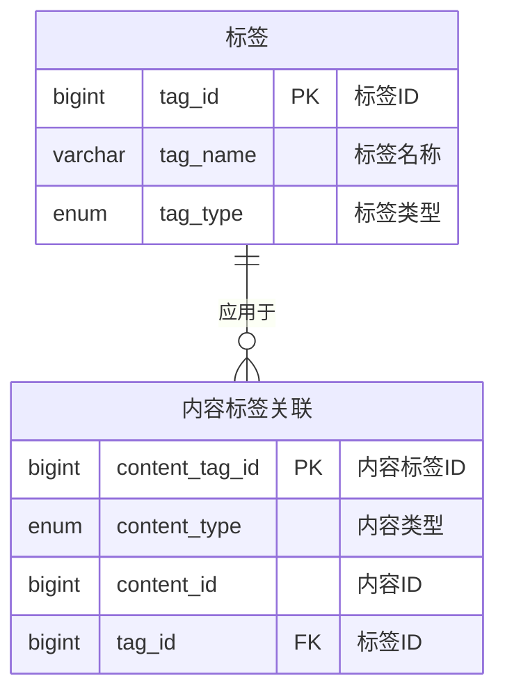
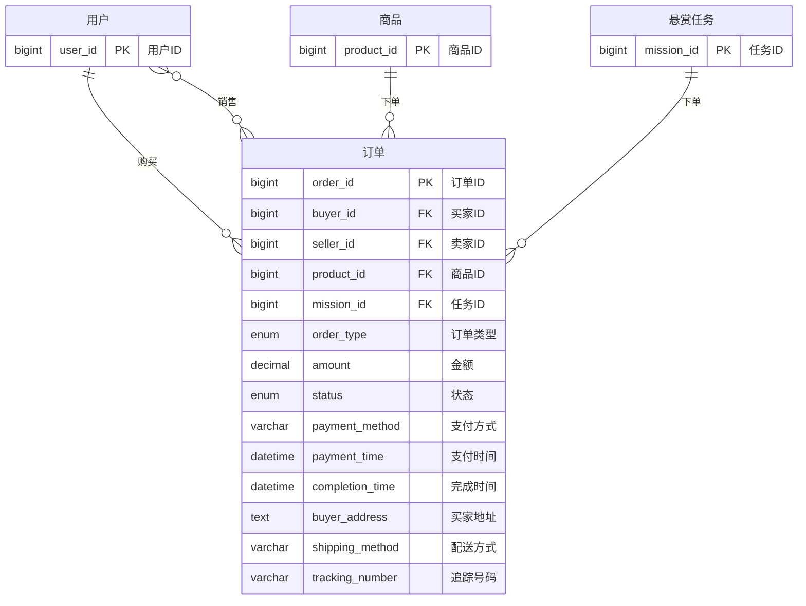

# 校园社交平台概念数据模型

## 1. 用户相关模型

### 1.1 用户与用户关系模型

## 2. 学校与学院模型

## 3. 内容发布模型

### 3.1 动态发布模型

### 3.2 商品发布模型

### 3.3 悬赏任务模型

## 4. 社交互动模型

## 5. 活动与社团模型

## 6. 通信与通知模型

## 7. 标签与分类模型

## 8. 订单与交易模型

