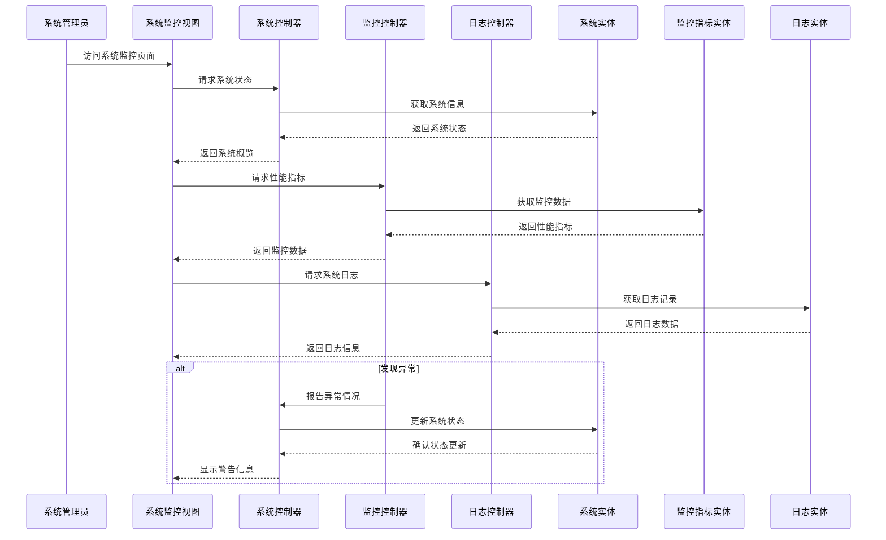
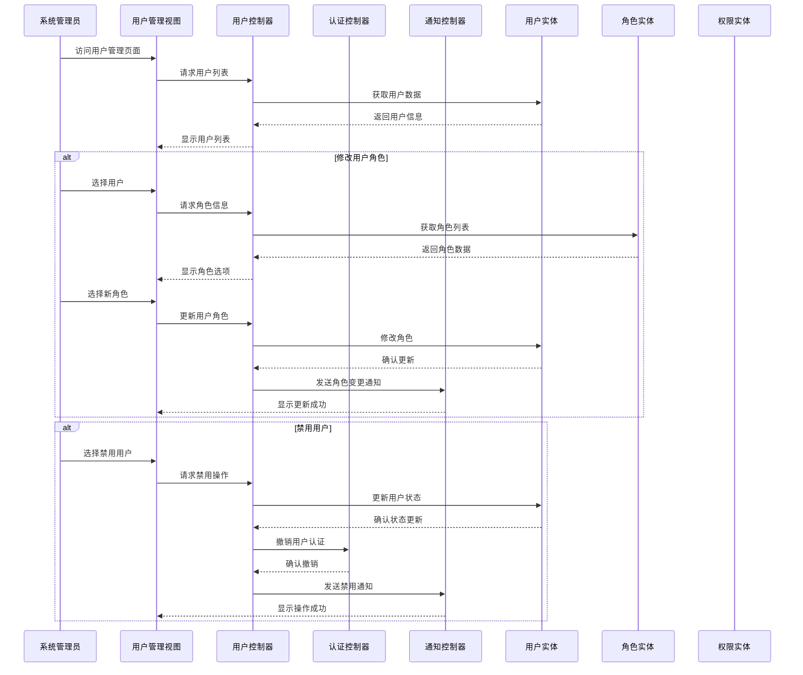
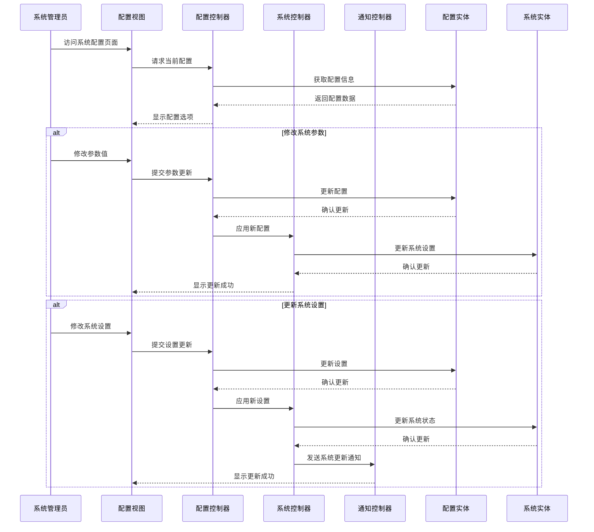

# 校园社交平台顺序图（三层架构）

## 1. 发布动态顺序图

```mermaid
sequenceDiagram
    actor Student as 学生
    boundary PostView as 动态界面
    boundary MediaView as 媒体上传界面
    control PostController as 动态控制器
    control AuthController as 认证控制器
    control MediaController as 媒体控制器
    entity Post as 动态实体
    entity Media as 媒体实体
    entity User as 用户实体

    Student->>PostView: 点击"发布动态"按钮
    PostView->>AuthController: 验证学校认证状态
    AuthController->>User: 获取用户认证信息
    User-->>AuthController: 返回认证状态
    
    alt 未完成认证
        AuthController-->>PostView: 返回认证失败
        PostView-->>Student: 提示"请先完成学校身份认证"
        Student->>PostView: 前往认证页面
    else 已完成认证
        AuthController-->>PostView: 返回认证成功
        PostView-->>Student: 显示发布表单
        
        Student->>PostView: 填写动态内容
        Student->>PostView: 选择可见范围
        
        alt 包含媒体文件
            Student->>PostView: 选择上传媒体
            PostView->>MediaView: 打开媒体上传界面
            Student->>MediaView: 上传图片/视频
            MediaView->>MediaController: 处理媒体上传
            MediaController->>Media: 创建媒体记录
            Media-->>MediaController: 返回媒体ID和URL
            MediaController-->>MediaView: 返回上传结果
            MediaView-->>PostView: 返回媒体信息
        end
        
        Student->>PostView: 点击"发布"按钮
        PostView->>PostController: 提交动态内容和媒体信息
        
        PostController->>Post: 创建动态记录
        Post-->>PostController: 返回创建结果
        
        alt 包含媒体
            PostController->>Media: 关联媒体到动态
            Media-->>PostController: 返回关联结果
        end
        
        PostController-->>PostView: 返回发布结果
        PostView-->>Student: 显示发布成功提示
    end
```

## 2. 发布商品顺序图

```mermaid
sequenceDiagram
    actor Student as 学生
    boundary ProductView as 商品界面
    boundary MediaView as 媒体上传界面
    control ProductController as 商品控制器
    control AuthController as 认证控制器
    control MediaController as 媒体控制器
    entity Product as 商品实体
    entity ProductImage as 商品图片实体
    entity User as 用户实体

    Student->>ProductView: 点击"发布商品"按钮
    ProductView->>AuthController: 验证学校认证状态
    AuthController->>User: 获取用户认证信息
    User-->>AuthController: 返回认证状态
    
    alt 未完成认证
        AuthController-->>ProductView: 返回认证失败
        ProductView-->>Student: 提示"请先完成学校身份认证"
        Student->>ProductView: 前往认证页面
    else 已完成认证
        AuthController-->>ProductView: 返回认证成功
        ProductView-->>Student: 显示商品发布表单
        
        Student->>ProductView: 填写商品信息(名称、描述、价格等)
        Student->>ProductView: 选择商品分类
        
        Student->>ProductView: 选择上传商品图片
        ProductView->>MediaView: 打开图片上传界面
        Student->>MediaView: 上传商品图片
        MediaView->>MediaController: 处理图片上传
        MediaController->>ProductImage: 创建图片记录
        ProductImage-->>MediaController: 返回图片ID和URL
        MediaController-->>MediaView: 返回上传结果
        MediaView-->>ProductView: 返回图片信息
        
        Student->>ProductView: 设置交易位置和方式
        Student->>ProductView: 点击"发布"按钮
        ProductView->>ProductController: 提交商品信息和图片
        
        ProductController->>Product: 创建商品记录
        Product-->>ProductController: 返回创建结果
        
        ProductController->>ProductImage: 关联图片到商品
        ProductImage-->>ProductController: 返回关联结果
        
        ProductController-->>ProductView: 返回发布结果
        ProductView-->>Student: 显示发布成功提示
    end
```

## 3. 发布悬赏顺序图

```mermaid
sequenceDiagram
    actor Student as 学生
    boundary MissionView as 悬赏界面
    control MissionController as 悬赏控制器
    control AuthController as 认证控制器
    control PaymentController as 支付控制器
    entity Mission as 悬赏实体
    entity User as 用户实体
    entity Account as 账户实体
    entity Transaction as 交易实体

    Student->>MissionView: 点击"发布悬赏"按钮
    MissionView->>AuthController: 验证学校认证状态
    AuthController->>User: 获取用户认证信息
    User-->>AuthController: 返回认证状态
    
    alt 未完成认证
        AuthController-->>MissionView: 返回认证失败
        MissionView-->>Student: 提示"请先完成学校身份认证"
        Student->>MissionView: 前往认证页面
    else 已完成认证
        AuthController-->>MissionView: 返回认证成功
        MissionView-->>Student: 显示悬赏发布表单
        
        Student->>MissionView: 填写任务标题和详细描述
        Student->>MissionView: 输入悬赏金额
        Student->>MissionView: 设置截止时间
        Student->>MissionView: 选择任务类别和难度
        Student->>MissionView: 点击"发布"按钮
        
        MissionView->>PaymentController: 验证账户余额
        PaymentController->>Account: 获取用户账户信息
        Account-->>PaymentController: 返回账户余额
        
        alt 余额不足
            PaymentController-->>MissionView: 返回余额不足
            MissionView-->>Student: 提示"余额不足"
            Student->>MissionView: 选择充值或调整金额
        else 余额充足
            PaymentController-->>MissionView: 返回余额充足
            MissionView->>MissionController: 提交悬赏信息
            
            MissionController->>Mission: 创建悬赏任务
            Mission-->>MissionController: 返回创建结果
            
            MissionController->>PaymentController: 请求冻结悬赏金额
            PaymentController->>Transaction: 创建冻结交易
            Transaction-->>PaymentController: 返回交易结果
            PaymentController->>Account: 更新账户余额(冻结金额)
            Account-->>PaymentController: 返回更新结果
            PaymentController-->>MissionController: 返回冻结结果
            
            MissionController-->>MissionView: 返回发布结果
            MissionView-->>Student: 显示发布成功提示
        end
    end
```

## 4. 购买商品顺序图

```mermaid
sequenceDiagram
    actor Buyer as 买家
    boundary ProductDetailView as 商品详情界面
    boundary OrderView as 订单界面
    control ProductController as 商品控制器
    control OrderController as 订单控制器
    control PaymentController as 支付控制器
    control NotificationController as 通知控制器
    entity Product as 商品实体
    entity Order as 订单实体
    entity Account as 账户实体
    entity Transaction as 交易实体
    entity User as 用户实体
    actor Seller as 卖家

    Buyer->>ProductDetailView: 浏览商品详情
    ProductDetailView->>ProductController: 获取商品信息
    ProductController->>Product: 查询商品
    Product-->>ProductController: 返回商品信息
    ProductController-->>ProductDetailView: 显示商品详情
    
    Buyer->>ProductDetailView: 点击"购买"按钮
    ProductDetailView->>ProductController: 检查商品状态
    ProductController->>Product: 查询商品状态
    Product-->>ProductController: 返回商品状态
    
    alt 商品已售出
        ProductController-->>ProductDetailView: 返回已售出状态
        ProductDetailView-->>Buyer: 提示"商品已售出"
    else 商品可购买
        ProductController-->>ProductDetailView: 返回可购买状态
        ProductDetailView->>OrderView: 跳转到订单页面
        
        OrderView-->>Buyer: 显示订单表单
        Buyer->>OrderView: 填写交易信息
        Buyer->>OrderView: 确认订单
        
        OrderView->>PaymentController: 验证账户余额
        PaymentController->>Account: 获取买家账户信息
        Account-->>PaymentController: 返回账户余额
        
        alt 余额不足
            PaymentController-->>OrderView: 返回余额不足
            OrderView-->>Buyer: 提示"余额不足"
            Buyer->>OrderView: 选择充值或取消
        else 余额充足
            PaymentController-->>OrderView: 返回余额充足
            OrderView->>OrderController: 提交订单信息
            
            OrderController->>Order: 创建订单记录
            Order-->>OrderController: 返回创建结果
            
            OrderController->>ProductController: An更新商品状态
            ProductController->>Product: 标记商品为预订
            Product-->>ProductController: 返回更新结果
            ProductController-->>OrderController: 返回更新结果
            
            OrderController->>PaymentController: 请求冻结支付金额
            PaymentController->>Transaction: 创建冻结交易
            Transaction-->>PaymentController: 返回交易结果
            PaymentController->>Account: 更新买家账户余额
            Account-->>PaymentController: 返回更新结果
            PaymentController-->>OrderController: 返回冻结结果
            
            OrderController->>NotificationController: 通知卖家新订单
            NotificationController->>User: 创建卖家通知
            User-->>NotificationController: 返回创建结果
            NotificationController-->>Seller: 发送新订单通知
            
            OrderController-->>OrderView: 返回订单创建结果
            OrderView-->>Buyer: 显示订单成功创建提示
        end
    end
```

## 5. 接取悬赏顺序图

```mermaid
sequenceDiagram
    actor Taker as 接单者
    boundary MissionDetailView as 悬赏详情界面
    boundary ApplyView as 接单申请界面
    control MissionController as 悬赏控制器
    control ApplyController as 接单控制器
    control NotificationController as 通知控制器
    entity Mission as 悬赏实体
    entity MissionApply as 悬赏接单实体
    entity User as 用户实体
    actor Publisher as 发布者

    Taker->>MissionDetailView: 浏览悬赏任务
    MissionDetailView->>MissionController: 获取悬赏信息
    MissionController->>Mission: 查询悬赏任务
    Mission-->>MissionController: 返回悬赏信息
    MissionController-->>MissionDetailView: 显示悬赏详情
    
    Taker->>MissionDetailView: 点击"接取"按钮
    MissionDetailView->>MissionController: 检查任务状态
    MissionController->>Mission: 查询任务状态
    Mission-->>MissionController: 返回任务状态
    
    alt 任务已关闭
        MissionController-->>MissionDetailView: 返回已关闭状态
        MissionDetailView-->>Taker: 提示"任务已不可接取"
    else 任务可接取
        MissionController-->>MissionDetailView: 返回可接取状态
        MissionDetailView->>ApplyView: 跳转到接单申请页面
        
        ApplyView-->>Taker: 显示接单申请表单
        Taker->>ApplyView: 填写接单申请说明
        Taker->>ApplyView: 确认接单
        
        ApplyView->>ApplyController: 提交接单申请
        ApplyController->>MissionApply: 创建接单申请
        MissionApply-->>ApplyController: 返回创建结果
        
        ApplyController->>NotificationController: 通知发布者新接单
        NotificationController->>User: 创建发布者通知
        User-->>NotificationController: 返回创建结果
        NotificationController-->>Publisher: 发送新接单通知
        
        ApplyController-->>ApplyView: 返回申请提交结果
        ApplyView-->>Taker: 显示申请提交成功提示
        
        alt 发布者审核接单
            Publisher->>NotificationController: 查看通知
            NotificationController->>MissionController: 获取接单详情
            MissionController->>MissionApply: 查询申请详情
            MissionApply-->>MissionController: 返回申请信息
            MissionController-->>Publisher: 显示申请详情
            
            alt 发布者拒绝
                Publisher->>MissionController: 拒绝接单
                MissionController->>MissionApply: 更新申请状态为拒绝
                MissionApply-->>MissionController: 返回更新结果
                MissionController->>NotificationController: 通知接单者被拒绝
                NotificationController->>User: 创建接单者通知
                User-->>NotificationController: 返回创建结果
                NotificationController-->>Taker: 发送申请被拒通知
            else 发布者接受
                Publisher->>MissionController: 接受接单
                MissionController->>MissionApply: 更新申请状态为接受
                MissionApply-->>MissionController: 返回更新结果
                MissionController->>Mission: 更新任务状态为进行中
                Mission-->>MissionController: 返回更新结果
                MissionController->>NotificationController: 通知接单者申请通过
                NotificationController->>User: 创建接单者通知
                User-->>NotificationController: 返回创建结果
                NotificationController-->>Taker: 发送申请通过通知
            end
        end
    end
```

## 6. 发布社团公告顺序图

```mermaid
sequenceDiagram
    actor Manager as 社团管理人
    boundary ClubView as 社团界面
    boundary AnnouncementView as 公告发布界面
    boundary MediaView as 媒体上传界面
    control ClubController as 社团控制器
    control AnnouncementController as 公告控制器
    control MediaController as 媒体控制器
    control NotificationController as 通知控制器
    entity Club as 社团实体
    entity Announcement as 公告实体
    entity Media as 媒体实体
    entity User as 用户实体
    entity ClubMember as 社团成员实体

    Manager->>ClubView: 进入社团管理页面
    ClubView->>ClubController: 获取社团信息
    ClubController->>Club: 查询社团
    Club-->>ClubController: 返回社团信息
    ClubController-->>ClubView: 显示社团管理界面
    
    Manager->>ClubView: 点击"发布公告"按钮
    ClubView->>AnnouncementView: 跳转到公告发布页面
    AnnouncementView-->>Manager: 显示公告发布表单
    
    Manager->>AnnouncementView: 填写公告标题
    Manager->>AnnouncementView: 填写公告内容
    
    alt 包含媒体文件
        Manager->>AnnouncementView: 选择上传媒体
        AnnouncementView->>MediaView: 打开媒体上传界面
        Manager->>MediaView: 上传图片/视频
        MediaView->>MediaController: 处理媒体上传
        MediaController->>Media: 创建媒体记录
        Media-->>MediaController: 返回媒体ID和URL
        MediaController-->>MediaView: 返回上传结果
        MediaView-->>AnnouncementView: 返回媒体信息
    end
    
    Manager->>AnnouncementView: 选择可见范围(全校/仅社团成员)
    Manager->>AnnouncementView: 点击"发布"按钮
    
    AnnouncementView->>AnnouncementController: 提交公告信息
    AnnouncementController->>ClubController: 验证发布权限
    ClubController->>ClubMember: 检查管理员权限
    ClubMember-->>ClubController: 返回权限验证结果
    
    alt 权限验证失败
        ClubController-->>AnnouncementController: 返回权限不足
        AnnouncementController-->>AnnouncementView: 返回发布失败
        AnnouncementView-->>Manager: 提示"权限不足"
    else 权限验证成功
        ClubController-->>AnnouncementController: 返回权限验证通过
        AnnouncementController->>Announcement: 创建公告记录
        Announcement-->>AnnouncementController: 返回创建结果
        
        alt 包含媒体
            AnnouncementController->>Media: 关联媒体到公告
            Media-->>AnnouncementController: 返回关联结果
        end
        
        AnnouncementController->>NotificationController: 通知相关用户
        
        alt 面向全校可见
            NotificationController->>User: 获取相关用户列表
            User-->>NotificationController: 返回用户列表
        else 仅社团成员可见
            NotificationController->>ClubMember: 获取社团成员列表
            ClubMember-->>NotificationController: 返回成员列表
        end
        
        NotificationController->>User: 创建通知记录
        User-->>NotificationController: 返回创建结果
        NotificationController-->>AnnouncementController: 返回通知发送结果
        
        AnnouncementController-->>AnnouncementView: 返回发布结果
        AnnouncementView-->>Manager: 显示发布成功提示
    end
```

## 7. 审核加入校园人员顺序图

```mermaid
sequenceDiagram
    actor SchoolAdmin as 学校管理员
    boundary SchoolView as 学校管理界面
    boundary UserReviewView as 用户审核界面
    boundary DetailView as 申请详情界面
    control SchoolController as 学校控制器
    control AuthController as 认证控制器
    control UserController as 用户控制器
    control NotificationController as 通知控制器
    entity School as 学校实体
    entity User as 用户实体
    entity VerificationRequest as 认证申请实体
    entity VerificationDocument as 认证文档实体
    actor Applicant as 申请者

    SchoolAdmin->>SchoolView: 进入学校管理页面
    SchoolView->>SchoolController: 获取学校信息
    SchoolController->>School: 查询学校
    School-->>SchoolController: 返回学校信息
    SchoolController-->>SchoolView: 显示学校管理界面
    
    SchoolAdmin->>SchoolView: 点击"用户审核"按钮
    SchoolView->>UserReviewView: 跳转到用户审核页面
    
    UserReviewView->>AuthController: 获取待审核用户列表
    AuthController->>VerificationRequest: 查询待审核申请
    VerificationRequest-->>AuthController: 返回申请列表
    AuthController-->>UserReviewView: 显示待审核列表
    
    SchoolAdmin->>UserReviewView: 选择查看申请详情
    UserReviewView->>DetailView: 打开申请详情页面
    
    DetailView->>AuthController: 获取申请详细信息
    AuthController->>VerificationRequest: 查询申请信息
    VerificationRequest-->>AuthController: 返回申请信息
    AuthController->>VerificationDocument: 获取证明材料
    VerificationDocument-->>AuthController: 返回证明材料
    AuthController->>UserController: 获取申请者基本信息
    UserController->>User: 查询用户信息
    User-->>UserController: 返回用户信息
    UserController-->>AuthController: 返回用户信息
    AuthController-->>DetailView: 返回完整申请信息
    DetailView-->>SchoolAdmin: 显示申请详情和证明材料
    
    alt 材料不完整
        SchoolAdmin->>DetailView: 点击"请求补充材料"
        DetailView->>AuthController: 提交补充材料请求
        AuthController->>VerificationRequest: 更新申请状态为"需补充"
        VerificationRequest-->>AuthController: 返回更新结果
        AuthController->>NotificationController: 通知申请者补充材料
        NotificationController->>User: 创建通知记录
        User-->>NotificationController: 返回创建结果
        NotificationController-->>Applicant: 发送补充材料通知
        
        Applicant->>NotificationController: 提交补充材料
        NotificationController->>AuthController: 转发补充材料
        AuthController->>VerificationDocument: 更新证明材料
        VerificationDocument-->>AuthController: 返回更新结果
        AuthController->>VerificationRequest: 更新申请状态为"待审核"
        VerificationRequest-->>AuthController: 返回更新结果
        AuthController-->>DetailView: 通知材料已更新
        DetailView-->>SchoolAdmin: 显示更新后的材料
    end
    
    SchoolAdmin->>DetailView: 验证申请信息
    DetailView->>SchoolController: 校验学生信息
    SchoolController->>School: 查询校内学生数据库
    School-->>SchoolController: 返回验证结果
    SchoolController-->>DetailView: 返回验证结果
    
    alt 验证失败
        DetailView-->>SchoolAdmin: 显示验证失败原因
        SchoolAdmin->>DetailView: 点击"拒绝"
        DetailView->>AuthController: 提交拒绝决定
        AuthController->>VerificationRequest: 更新申请状态为"拒绝"
        VerificationRequest-->>AuthController: 返回更新结果
        AuthController->>NotificationController: 通知申请者被拒绝
        NotificationController->>User: 创建通知记录
        User-->>NotificationController: 返回创建结果
        NotificationController-->>Applicant: 发送拒绝通知
    else 验证通过
        DetailView-->>SchoolAdmin: 显示验证通过
        SchoolAdmin->>DetailView: 点击"通过"
        DetailView->>AuthController: 提交通过决定
        AuthController->>VerificationRequest: 更新申请状态为"通过"
        VerificationRequest-->>AuthController: 返回更新结果
        AuthController->>UserController: 更新用户学校认证状态
        UserController->>User: 更新用户状态为"已认证"
        User-->>UserController: 返回更新结果
        UserController-->>AuthController: 返回用户更新结果
        AuthController->>NotificationController: 通知申请者审核通过
        NotificationController->>User: 创建通知记录
        User-->>NotificationController: 返回创建结果
        NotificationController-->>Applicant: 发送通过通知
    end
    
    AuthController-->>DetailView: 返回处理结果
    DetailView-->>SchoolAdmin: 显示处理完成提示
```

### 6. 系统管理员用例

#### 6.1 系统监控


#### 6.2 用户管理


#### 6.3 系统配置
